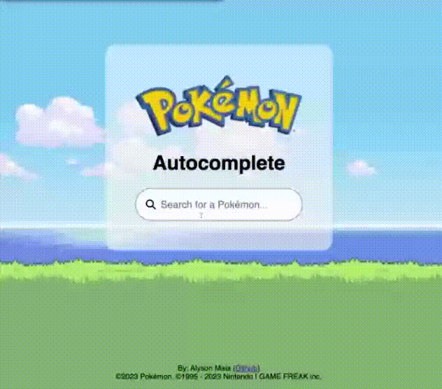

# Pokemon Autocomplete 🚀

Pokemon Autocomplete is a simple React app that suggests Pokemon names from the first generation as you type, inspired by the autocomplete behavior of the YouTube search bar.



## Features 🌟

- Dynamic autocomplete suggestions sourced from [Poke API](https://pokeapi.co/).
- Minimalistic and responsive design.

## Technologies Used 💼

- **Framework**: React (with Typescript)
- **Testing**: Jest and Testing Library
- **Code Formatting**: Prettier

## Getting Started 🏁

1. **Clone the repo**:
   ```bash
   git clone https://github.com/FederalCircle/pokemon-autocomplete.git
   ```
2. **Navigate to the project directory**:
   ```bash
   cd pokemon-autocomplete
   ```
3. **Install dependencies**:
   ```bash
   npm install
   ```
4. **Run the app**:
   ```bash
   npm start
   ```
   Open your browser and visit [http://localhost:3000](http://localhost:3000) to see the app in action.

## Contributions 🤝

This was a side project developed during an interview process. Though I appreciate the interest, this project is not currently open for contributions. It's pinned on my GitHub for showcase purposes.

## Credits & Acknowledgments 🙏

- **Poke API**: The Pokemon names are sourced from [Poke API](https://pokeapi.co/).
- **YouTube**: The autocomplete behavior is inspired by the autocomplete behavior from the YouTube search bar.
